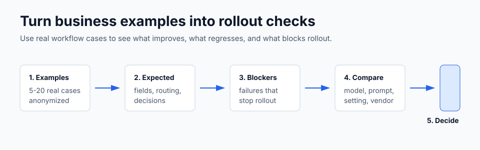
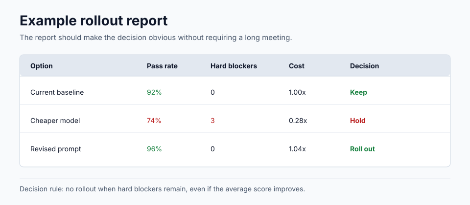

# ProcessBench

Business-specific AI benchmark packs for teams that already have AI workflows.

Public model benchmarks answer, "Which model is generally strong?"

ProcessBench helps answer, "Which model, prompt, setting, or vendor still works for this business process?"

It gives teams a practical starting point for turning real workflow examples into repeatable regression checks. The goal is not to replace eval frameworks. The goal is to make the first useful benchmark easier to design.



## Start Here

If you are not technical, start with this 30-minute path:

1. Pick one workflow that already uses AI.
2. Collect 5 to 10 real examples from that workflow.
3. Remove names, customer data, secrets, and private account details.
4. Write what a good answer must contain.
5. Write what would make the answer unacceptable.
6. Ask a technical teammate to put those examples into the closest folder below.
7. Use the report template to decide whether the model, prompt, setting, or vendor is safe to change.

The first benchmark does not need to be large. It needs to make the most important failures visible before they reach customers, operators, or internal teams.

## Pick A Starting Point

If you were sent this repository by a product, operations, AI, or technology leader, start with the folder closest to the workflow you need to test.

| Business context | Start here | Typical workflows |
|---|---|---|
| B2B software, telecom, professional services | [`b2b-software-telecom-professional-services/`](b2b-software-telecom-professional-services/) | ticket routing, RFP answers, delivery notes, account summaries, telecom triage |
| Manufacturing, industrial, energy | [`manufacturing-industrial-energy/`](manufacturing-industrial-energy/) | maintenance logs, SOP answers, quality incidents, engineering changes, scheduling constraints |
| Retail, e-commerce, consumer goods | [`retail-ecommerce-consumer-goods/`](retail-ecommerce-consumer-goods/) | product content, search relevance, returns, campaign copy, merchandising checks |

Each folder contains:

- `README.md` for the local workflow context
- `deliverables.md` with benchmark pack ideas
- `promptfoo.example.yaml` as a runnable or adaptable starting point
- `prompts/` with minimal prompt templates referenced by the example config

## What You Build



The useful output is a small report:

- what changed
- which examples passed
- which examples regressed
- which failures block rollout
- what should happen next

## What This Is

ProcessBench sits between public model benchmarks and ad hoc spreadsheet testing.

It helps structure:

- representative workflow cases
- expected outputs
- hard blockers
- regression checks
- model, prompt, setting, or vendor comparisons
- report formats for rollout decisions

It is intentionally small. The benchmark packs are meant to be copied, edited, and connected to the evaluation stack already used by your team.

## Who This Is For

The likely reader is a:

- product or operations owner
- technical lead
- AI engineer
- solutions architect
- analytics or data lead
- platform engineer

You do not need to be an evals researcher. A non-technical owner can define the examples, expected outcomes, and unacceptable failures. A technical teammate can turn that into YAML or JSONL and connect it to the model provider.

## Quick Start

1. Open the folder closest to your workflow.
2. Read `deliverables.md` and pick one benchmark shape.
3. Open `promptfoo.example.yaml`.
4. Replace the sample cases with anonymized examples from your process.
5. Encode hard blockers as assertions where possible.
6. Run the example locally or adapt it to your existing eval stack.
7. Summarize results with [`templates/regression-report.md`](templates/regression-report.md).

## No-Credential Demo

Run the included offline demo first. It does not call a model. It shows the shape of the expected pass/fail report.

```bash
npm run demo
```

The demo reads [`examples/b2b-support-demo.jsonl`](examples/b2b-support-demo.jsonl), checks expected fields and hard blockers, and prints a small rollout report. Use it to understand the benchmark structure before connecting real model providers.

## Minimal Run Path

The example configs use [promptfoo](https://github.com/promptfoo/promptfoo) because it is easy to inspect, easy to run locally, and works well for model, prompt, and provider comparison.

Install dependencies:

```bash
npm install
```

Run one example:

```bash
npm run eval:b2b
```

You will need provider credentials for the models you keep in the config. Remove providers you do not use.

## What To Change First

Replace these before trusting any result:

- sample inputs
- expected JSON fields
- hard blockers
- provider list
- prompt wording
- report thresholds

The bundled examples are not universal benchmarks. They are scaffolds for building business-specific ones.

## What Counts As A Good First Benchmark

A useful first benchmark usually has:

- 5 to 20 anonymized examples
- one clear workflow
- expected fields or decisions
- hard blockers that stop rollout
- one report comparing current and proposed behavior

Do not start with every workflow. Start where a wrong answer would waste time, trigger escalation, mislead a customer, or create rework.

## Builds On

ProcessBench is a workflow-pack layer on top of existing evaluation tools.

- [promptfoo](https://github.com/promptfoo/promptfoo) for declarative model, prompt, and provider comparison.
- [DeepEval](https://github.com/confident-ai/deepeval) for Python-native LLM tests and custom metrics.
- [Ragas](https://github.com/vibrantlabsai/ragas) for retrieval-heavy workflows.
- [LangGraph](https://github.com/langchain-ai/langgraph) and LangSmith for stateful agent workflows and tracing.
- [OpenAI Evals](https://github.com/openai/evals) and [Inspect](https://github.com/UKGovernmentBEIS/inspect_ai) for private or research-grade eval design.

## Templates

- [`templates/benchmark-sprint.md`](templates/benchmark-sprint.md) for planning a first benchmark pass
- [`templates/scoring-rubric.md`](templates/scoring-rubric.md) for defining pass, warning, fail, and blocker outcomes
- [`templates/regression-report.md`](templates/regression-report.md) for summarizing model or prompt changes
- [`templates/use-case-fixture.jsonl`](templates/use-case-fixture.jsonl) for example fixture shape

## Repository Layout

```text
b2b-software-telecom-professional-services/
manufacturing-industrial-energy/
retail-ecommerce-consumer-goods/
adapters/
templates/
```

## Scope

ProcessBench focuses on commercial and operational AI workflows where quality, consistency, throughput, and process control matter.

Finance, insurance, healthcare, and pharma are intentionally not the starting point here. Those areas often need heavier regulatory operating models than this repository should imply.
